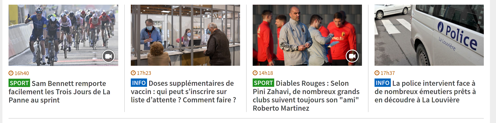
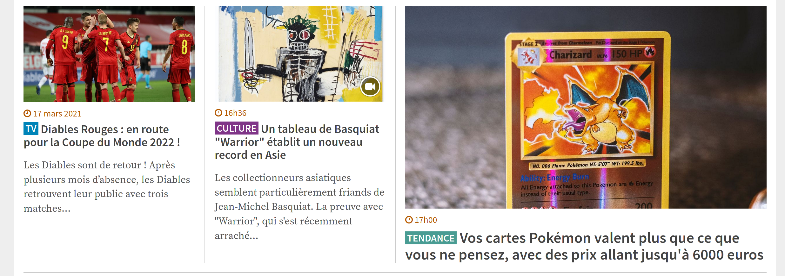
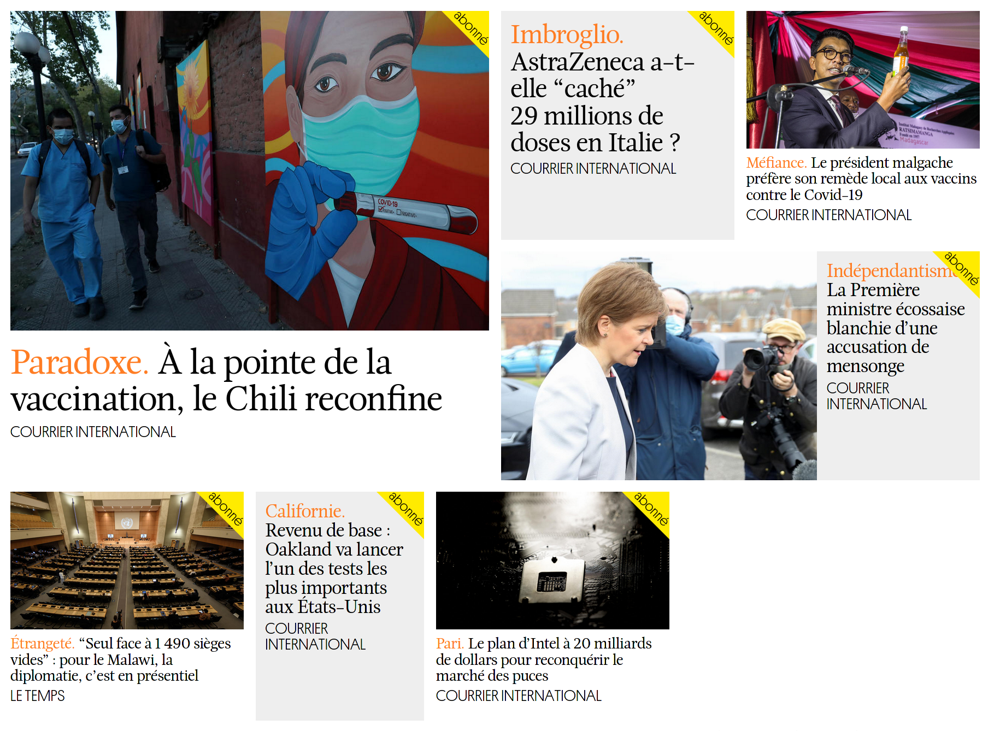
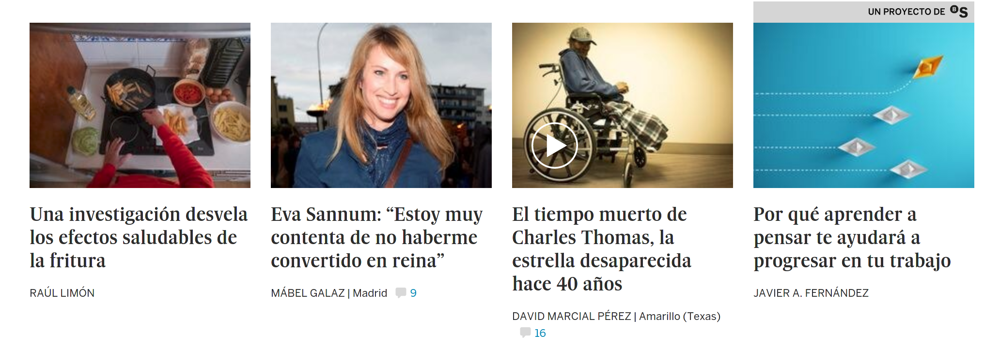
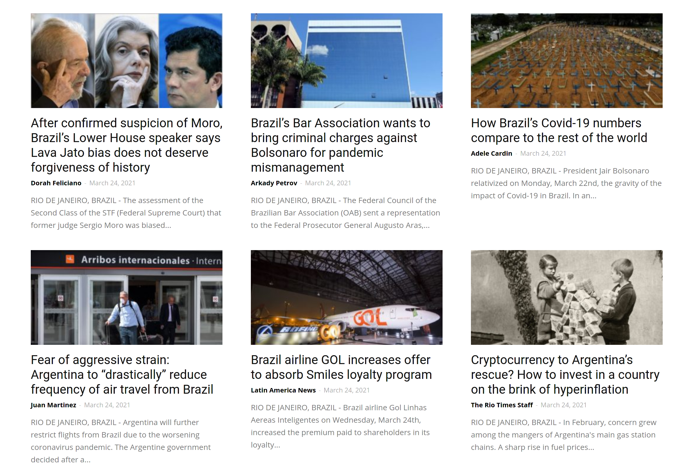

# UI Prototyping

web prototype project

## briefing:

You are designing a homepage for a fictional online news publisher. On this homepage you will display card / preview style links to multiple articles. You should create a hierarchy in the articles, displaying some headlines in big, medium importance articles in a secondary size and a third size of article for 'older' or less important news.

## Examples of card / style links:

↓ RTBF.be

↓ RTBF.be

↓ Courier International

↓ elpais.com

↓ riotimesonline.com

Your homepage will showcase and link to the 12 supplied articles (`articles/` folder) in 5 different categories. You are welcome to add more articles to the list, but you must use the 12 supplied articles as the very least. You might find that adding more content and more articles will help designing a better looking news homepage.

This project is not focused information architecture, but on managing a complex layout of many articles side by side. Focus on designing the home page of this fictional news website and don't worry about navigating into each article.

The supplied articles have categories in the filenames. The categories are:

* Main news
* Politics
* Music
* Art
* Science

The articles are supplied in .odt (similar to Word) format, you can use any images from the document, bits of text, and you should reuse the title of the article. Consider also using the name of the author. Links to the original articles are supplied in the documents themselves.

Design a menu that will let visitors view articles only in a selected category, as well as any other features that you think would be useful to a newspaper homepage (date, search, ...)

This is a high-fidelity prototype project where you are using HTML and CSS (+JS if you wish) to build the prototype. Your prototype should also be 100% responsive using the css grid provided in the module, or another grid system of your choice.

Display your ability to use typography, structure information, make good, clear layouts that work well on all screen sizes. Make the prototype as convincing as possible and apply the rule of 'consistency in design'.

#### Delivery date:

Thursday 29th April 2021 @ 11AM

Submission through a github / gitlab repository link
